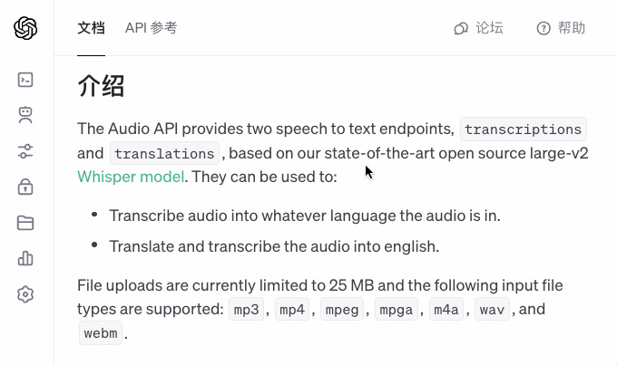
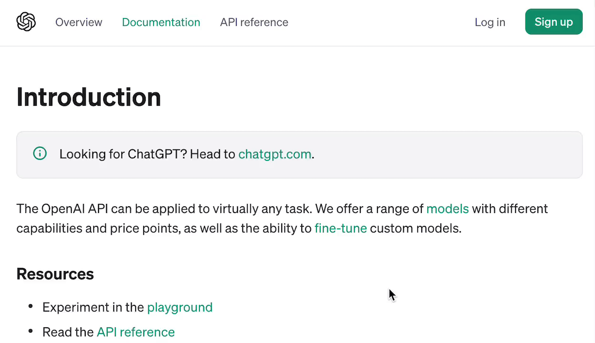
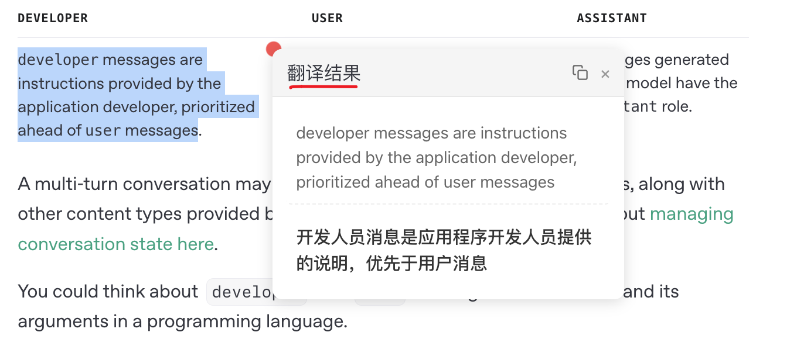

# bilingual translate

> [English](./misc/README_EN.md) | 中文

一款开源浏览器双语翻译扩展，让所有人都能够拥有母语般的阅读体验。

1. [本地文档](./docs)
2. [B站视频介绍](https://www.bilibili.com/video/BV1ux4y1e73x/)

## 🌟 特性

- **智能翻译**：支持 20+ 种翻译引擎，包括传统翻译和 AI 大模型。如：微软翻译、谷歌翻译、DeepL翻译、OpenAI、DeepSeek、Kimi、Ollama、自定义引擎等。
- **双语对照**：支持原文与译文并列显示，让阅读更轻松。
- **划词翻译**：选中任意文本，即可获得即时翻译结果，一键复制译文，提高阅读效率。
- **全文翻译**：通过悬浮球一键翻译整个网页，无需刷新页面即可切换。
- **隐私保护**：所有数据本地存储，代码开源透明。
- **高度定制**：丰富的自定义选项，满足不同场景需求。
- **完全免费**：开源免费，非商业化项目。

<kbd></kbd>

<kbd></kbd>

<kbd></kbd>

## 📦 安装

目前尚未发布到浏览器商店，请从源码构建后手动加载扩展：

```bash
pnpm install
pnpm build
```

构建产物位于 `.output/chrome-mv3`，可在浏览器扩展管理页面中以开发者模式加载。

## 📖 使用文档

请查看仓库内的 `docs/` 获取详细的：
- 功能介绍
- 配置指南
- 使用教程
- 常见问题
